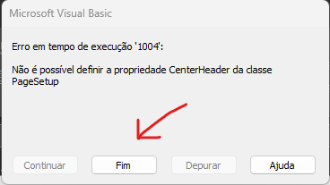

# Auto_PCI_RAE

Esse programa preenche automaticamente a RAE com os dados da PCI

# [DOWNLOAD](https://github.com/fssLeet/Auto_PCI_RAE/releases)

## Como utilizar

#### 1º Passo: 
```
Selecione a PCI (compatível com versões 2022 e 2023)
```
#### 2º Passo:
```
Selecione a RAE (compatível apenas com a versão 11-AGO-2023)
```
#### 3º Passo:
```
Clique em "Fim" na mensagem de erro da RAE e/ou PCI
```

<br>*Obs: esse erro é da própria planilha* 
```
Atenção: Após a cópia automática confira todos o dados!
```

## Perguntas Frequentes (FAQ)

### 1. Quais dados são copiados ?

Dados do proponente (nome, cpf, telefone), RT (nome, cpf, telefone), endereço, complemento, bairro, CEP, municipio, matricula, oficio, incidências e cronograma acumulado.

### 2. Os dados não foram copiados ?

* Provavelmente foi utilizado uma PCI/RAE antiga com versão de 2021 
* O arquivo excel da PCI/RAE está bloqueado (clica com botão direito no arquivo > propriedades > desbloquear)
* O proponente/RT modificou o arquivo excel PCI/RAE
* Existe algum erro no arquivo excel da PCI/RAE (tente abrir no excel e corrigir).

### 3. As formulas, formatação ou outros campos da RAE são modificadas ?

Não, o programa usa apenas operações de 'copiar' e 'colar' entre as planilhas.

## Sugestões

Envie e-mail para: fst.engenharia@gmail.com

## Built With

* [Python](https://www.python.org/) - Linguagem de programação
* [xlwings](https://www.xlwings.org/) - Biblioteca para manipulação de arquivos excel